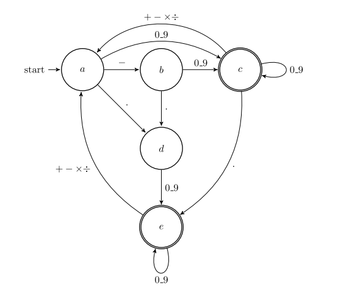

# **Typescript Calculator**

## Automate de vérification - 06/02/23

### src/app/Automate.ts

> let result = Automate.valideCalcul("1+1=2"); : true

> let result = Automate.valideCalcul("1++1=2"); : [2, "numérique attendu"]

### src/tests/Automate.test.ts

> test("1+1=2", () => { expect(Automate.valideCalcul("1+1=2")).toBe(true); });

> test("a+1=1 | état a, index 0", () => { expect(Automate.valideCalcul("a+1=1")).toStrictEqual([0, "numérique attendu"]); });
